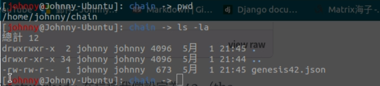
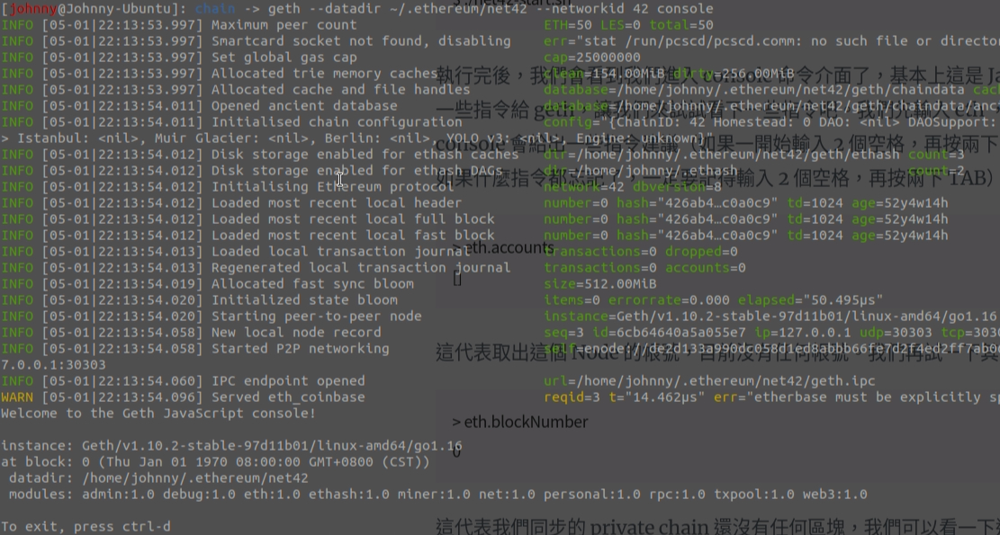
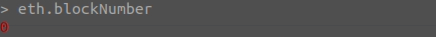

# Geth 建立私有網路

<br>

---

<br>

## 在 Ubuntu 上安裝 ethereum

<br>

```bash
sudo apt-get install -y software-properties-common
sudo add-apt-repository -y ppa:ethereum/ethereum
sudo apt-get update
sudo apt-get install -y ethereum
```

<br>

## 建立 Private Net

<br>

首先在 ~/chain 目錄建立檔案 genesis42.json （chain 資料夾要自己建立），輸入以下內容：

<br>

```json
{
    "config": {
        "chainId": 42,
        "homesteadBlock": 0,
        "eip150Block": 0,
        "eip150Hash":"0x0000000000000000000000000000000000000000000000000000000000000000",
        "eip155Block": 0,
        "eip158Block": 0,
        "byzantiumBlock": 0
    },
    "nonce": "0x0000000000000042",
    "timestamp": "0x00",
    "parentHash": "0x0000000000000000000000000000000000000000000000000000000000000000",
    "extraData": "0x00",
    "gasLimit": "0x4c4b40",
    "difficulty": "0x0400",
    "mixhash": "0x0000000000000000000000000000000000000000000000000000000000000000",
    "coinbase": "0x0000000000000000000000000000000000000000",
    "alloc": {
    }
}
```

<br>

`chainId` 設定為 `42`，然後 `difficulty` 設定為 `0x0400` 代表運算難度為 1024。讓 private chain 大約只要 10–15 秒就能產生一個 block。

<br>

檔案路徑如下：

<br>



<br>

初始化 private chain，告知 geth 我們把 genesis42.json 檔案
放在哪裡：

<br>

```bash
geth --datadir ~/.ethereum/net42 init ~/chain/genesis42.json
```

<br>

啟動命令：

```bash
geth --datadir ~/.ethereum/net42 --networkid 42 console
```

指定 `networkId` 為 `42` 並且執行 `console` 。

<br>

執行成功後畫面如下：

<br>



<br>

檢查一下 block 數量：

<br>

```bash
eth.blockNumber
```
<br>



<br>

因為我們還沒開挖，所以顯示 0 是正常的。 

完成！！
