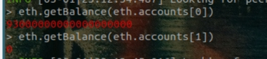
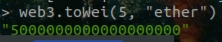
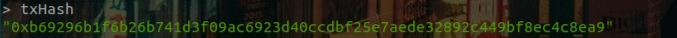
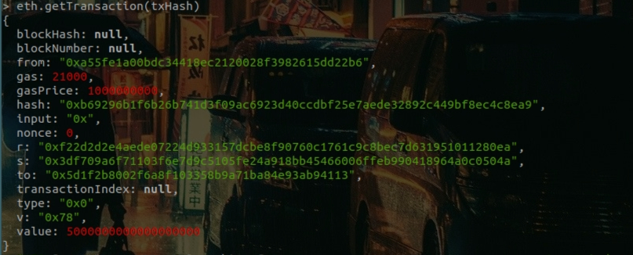
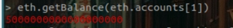
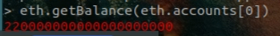

# 建立交易

<br>

---

<br>

## Stop mining and check the balance of the two accounts

<br>

停止挖礦指令：`miner.stop()`

<br>

檢查兩個帳戶的存款：

```bash
eth.getBalance(eth.accounts[0]) // 檢查第一個帳戶
```

```bash
eth.getBalance(eth.accounts[1]) // 檢查第二個帳戶
```

<br>



<br>
<br>
<br>
<br>

## Create a transaction from the ether base account to another account

<br>

在正式交易前，要先解鎖 account[0] 也就是付錢的那個帳戶：

<br>

```bash
personal.unlockAccount(eth.accounts[0])
```

輸入完一次密碼看到 true 回應就算完成了。

<br>

我們試著送出 5 個 ether，前面我們查看 balance 的時候，可以發現我們的帳號 0 有 91 個 ether 但是顯示上來看是 910000000...000，這是因為計量單位不一樣，我們可以使用以下命令來換算：

<br>

```bash
web3.toWei(5, "ether")
```

<br>



<br>

建立交易：

<br>

```bash
var txHash = eth.sendTransaction({ from: eth.accounts[0], to: eth.accounts[1], value: web3.toWei(5, "ether") })
```

<br>
<br>
<br>
<br>

## Send the transaction

<br>

輸入我們上個步驟建立的 func，就可以送出交易了：

<br>

```bash
txHash
```

<br>



<br>
<br>
<br>
<br>

## Check the transaction pool

<br>

交易完成後看一下交易資料 ：

<br>

```bash
eth.getTransaction(txHash)
```

<br>



<br>

發現 blockNumber 是 null，因為這筆交易未被確認（沒被礦工登記到區塊中），這時你去鑒察一下 account 們的存款狀況會發現沒有變化，這是正常的，因為我們要開啟挖礦，把資料登記進去。

<br>
<br>
<br>
<br>

## Start mining

<br>

```bash
miner.start(1)
```

等待 30-60 秒之後關閉挖礦

<br>

```bash
miner.stop()
```

<br>
<br>
<br>
<br>

## Check the balance of the two accounts

<br>

結束挖礦之後檢查一下兩個帳號的存款，主要檢查 account[1]：

<br>

```bash
eth.getBalance(eth.accounts[1])
```

<br>



<br>

看看 accont[0]：

<br>

```bash
eth.getBalance(eth.accounts[0])
```

<br>



<br>

完成！！！！
