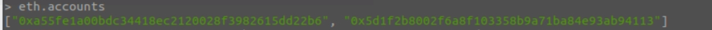

## 建立帳號挖礦

<br>

---

<br>

題目要求建立 2 個帳號，所以就按照題目做：

<br>

 ```bash
 personal.newAccount()
```

<br>


<br>

他會要求重複輸入密碼，像這樣：

<br>

```bash
Passphrase:
Repeat passphrase:
```

<br>

然後他會回傳一個帳號給我們(綠色的那個)，我的長這樣：

<br>

```bash
0xa55fe1a00bdc34418ec2120028f3982615dd22b6
```

<br>

接下來重複做一次，建立第二組帳號。這邊就不展示了。

<br>

建立好 2 個帳號之後使用 `eth.accounts` 看一下帳號：

<br>



<br>

根據題目要求，把第一個帳號設定成 Etherbase：

<br>

```bash
miner.setEtherbase(eth.accounts[0])
```

<br>


<br>

開始挖礦：

<br>

```bash
miner.start(1)
```

參數 1 表示我們開一個 Thread 運算。過一會之後我們 stop 挖礦，看一下 block 數量以及存款：

<br>

```bash
miner.stop() // 停止挖礦
```

```bash
eth.blockNumber // block 數量
```

```bash
eth.getBalance(eth.accounts[0])
```

<br>


<br>

完成！！！
